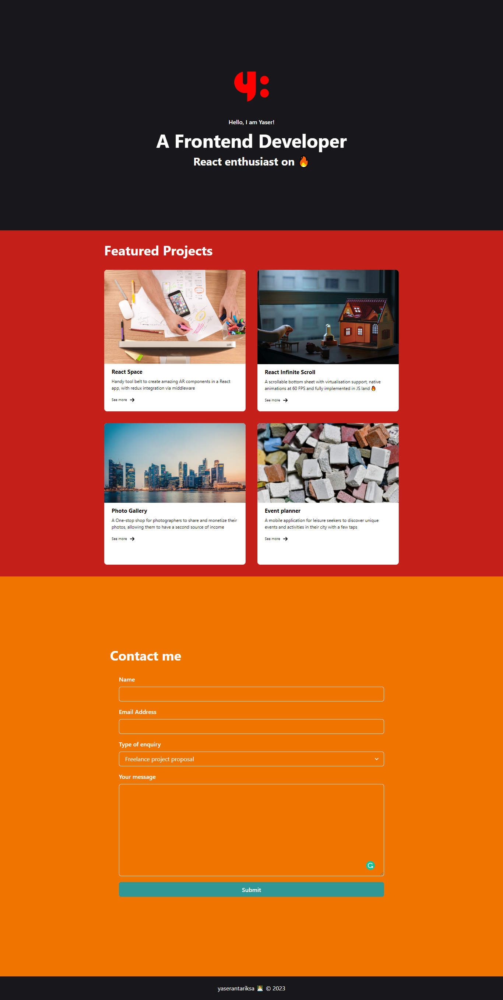

# Portofolio Demo

## Introduction

Hi this is simple portofolio landing page, simple but I realy ❤ this

This is single page portfolio landing page with Home, Projects, and Contact Me sections.

## Libraries

#### * Chakra UI
In any case, feel free to check their official [documentation](https://chakra-ui.com/docs/components) to see all the components at your disposal and their corresponding props.

#### *Formik and Yup
#### *FontAwesome

Overall display:

Display with success message:

Display with error message:

### Thanks...

